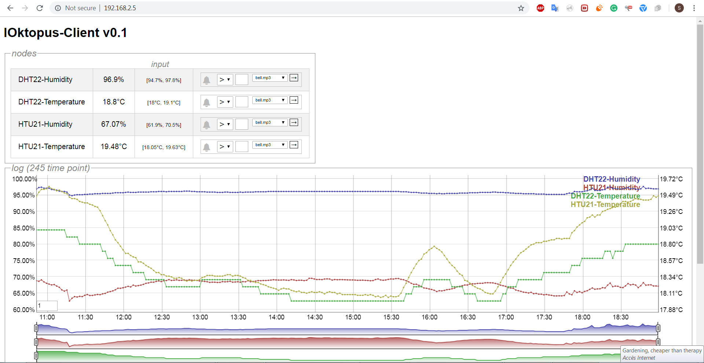

# IOktopus	
## website/blog : https://esp8266life.wordpress.com/ 
## Features

IOktopus is a sensor logger and controller for ESP8266. Current version runs a c++ server on board and provide a javascript client that :
- allows to monitor sensor values from your browser (supported sensors so far : DHT22, DS18B20, HTU21, SHT15)
- provides a browser alarm on each sensor value
- keeps and show max min values 
- allows to explore sensors history in a zoomable graph (using dygraphs js), saved values in board memory (up to 1000items) or flash (up to 60000 items)
- display board state (responsiveness, last boot)
	
Full version of IOktopus will additionally allow to :
	- display current and history of actuators values (relays, leds, motors,piezo)
	- directely control actuators values from browser
	- activate rules that control actuators from sensor values or timestamp (thermo/humidistat, timer)
	- build custom rules from basic operations, such as assign, compare, time, expressions (tinyexpression integration)
	
IOktopus also runs on x86 with emulated sensors for demonstration and development purpose
	
## How to run IOktopus
### Run the binary
### Compile the code

## Code presentation
### Folders
The code is organised by layers :
- IOktopus.ino & IOktopusx86.cxx : the launcher (and x86 launcher)
- "modules/" : contain the main high level modules : a server, a logger, a data model, sensors device modules. These modules are expressed by an generic Interface and implemented in successive version. The modularity here is that each module version can be swapped (hot or at compile time) by any other module version without having to make any other change.
- "datastruct/" :  contain the datastructures for strings, lists, maps, and treemaps. The definitons of datastructures is also modular and allow at compile time to change the type of underlying implementation for each structure.
- "infrastructure/" : contain the "hardware" infrastructure for network, clock, sensors, filesystem and debug printing. It contain common classes + specific esp implementation, and x86 equivalent or emulation.
- "tests/" : contain partial testing functions for datastructures or infrastructure.
- "localdata/js/" : contain the code of javascript client 
	
The other folders :
- "localdata/" and "data/" contain the files, client and data, to be transferred to the board before starting the program
-- "localdata/js/" contain the client javascript source files : IOktopusClient, RemoteModel, Controller, UserView + dygraph, component, event emitter
- "releases/" : contain the binary version of the program to be transferred to the board and the binary that can be run on windows
- "customdependencies/" : contains the dependencies that has been modified and that need to be reinstalled in Arduino library folder
